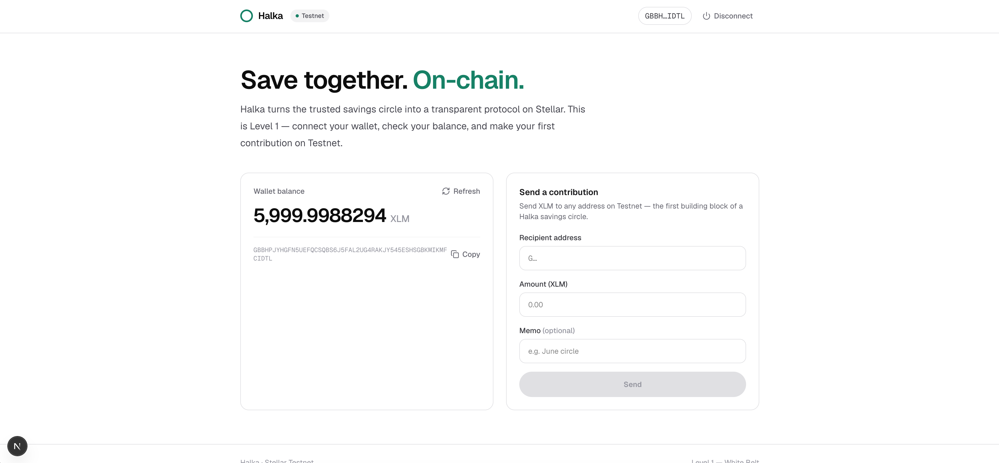
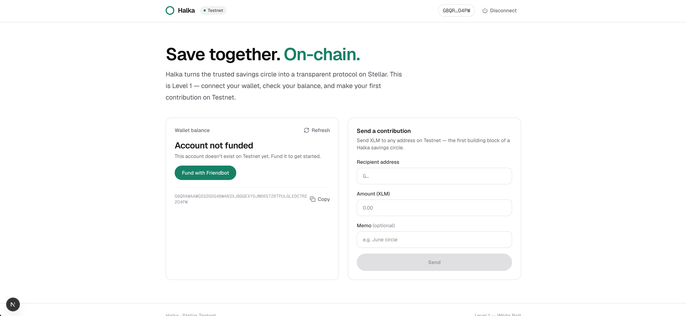
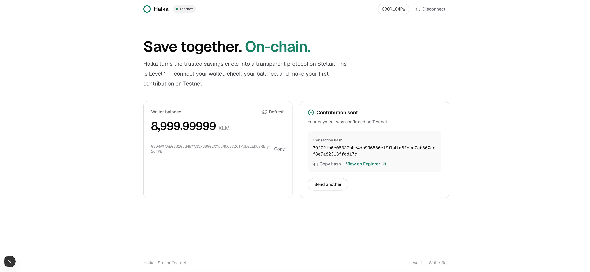

# Halka

**On-chain savings circles (ROSCA) on Stellar.**

Halka turns the trusted savings circle — known as _altın günü_ in Turkey, _tanda_ in Latin America, _susu_ in West Africa, _chit fund_ in India — into a transparent, enforceable, borderless protocol on Stellar.

This repository is built level-by-level for the **Stellar Journey to Mastery** builder challenge.

---

## Level 1 — White Belt

A working Stellar **Testnet** dApp covering the fundamentals: wallet connection, balances, and payments.

### Features
- **Connect / disconnect** a Freighter wallet on the Stellar Testnet
- **Fetch and display** the connected wallet's XLM balance
- **Fund** an unfunded account with one click via Friendbot
- **Send an XLM payment** (a circle "contribution") to any address
- Clear **success / failure** feedback with the **transaction hash** and an Explorer link
- Network guard that warns if the wallet is not on Testnet

### Tech stack
- [Next.js 16](https://nextjs.org/) (App Router) + TypeScript
- [TailwindCSS v4](https://tailwindcss.com/)
- [`@stellar/stellar-sdk`](https://github.com/stellar/js-stellar-sdk) (Horizon)
- [`@stellar/freighter-api`](https://www.npmjs.com/package/@stellar/freighter-api)

---

## Getting started

### Prerequisites
- [Node.js](https://nodejs.org/) 18+ (npm comes bundled)
- The [Freighter](https://www.freighter.app/) browser extension, set to **Testnet**

### Run locally
```bash
cd web
npm install
npm run dev
```
Open [http://localhost:3000](http://localhost:3000).

1. Click **Connect wallet** and approve in Freighter.
2. If the account is new, click **Fund with Friendbot** to receive Testnet XLM.
3. Enter a recipient address and amount, then **Send**.
4. The transaction hash and an Explorer link are shown on success.

---

## Screenshots

| Wallet connected | Balance displayed | Successful transaction |
| --- | --- | --- |
|  |  |  |

---

## Network

Halka runs entirely on the **Stellar Testnet** for Levels 1–3. Mainnet is part of the roadmap.

## Roadmap
- **L1 — White Belt:** wallet, balance, payments _(this level)_
- **L2 — Yellow Belt:** multi-wallet + first Soroban `Circle` contract with live events
- **L3 — Orange Belt:** `Factory` + `Reputation` contracts, tests, CI/CD, mobile
- **L4+:** anchor fiat ramps, yield, portable on-chain credit score
