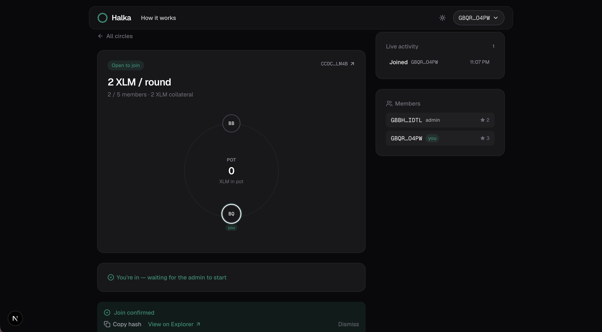
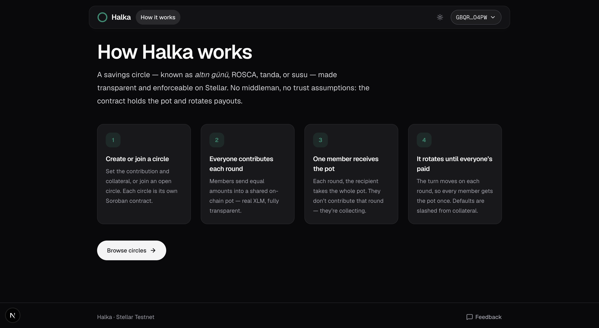
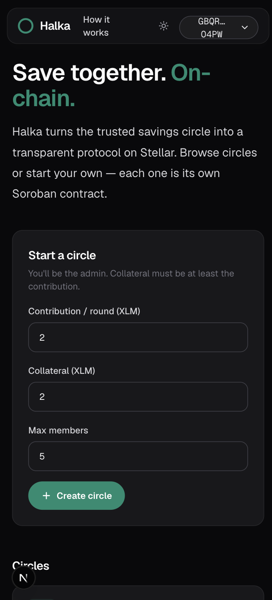
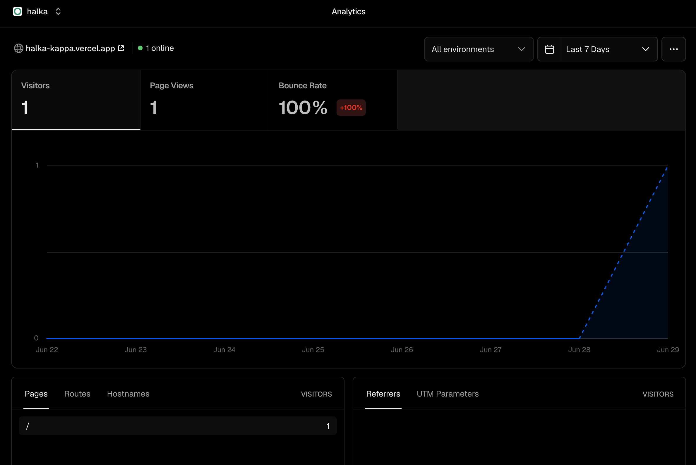
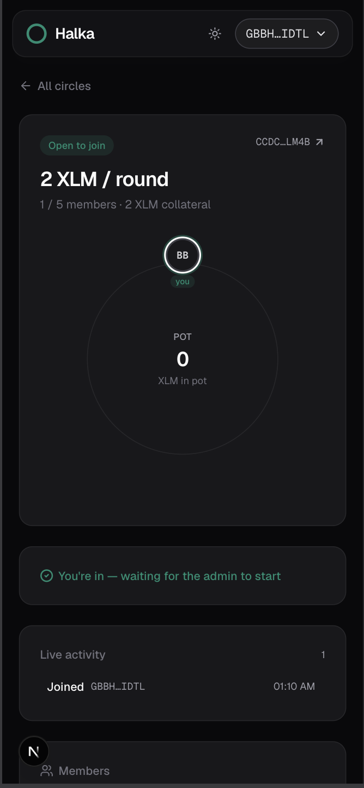
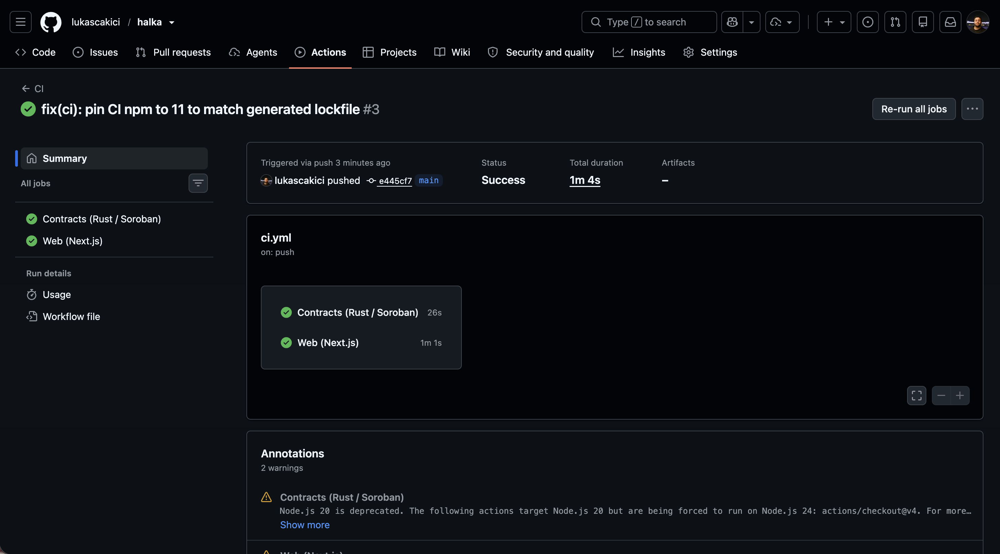
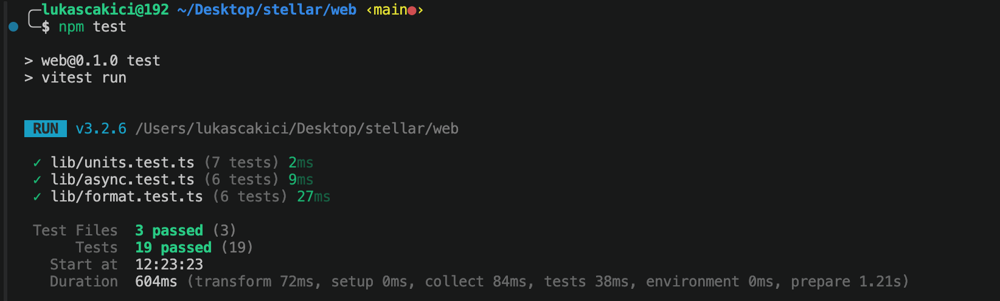

# Halka

**On-chain savings circles (ROSCA) on Stellar.**

Halka turns the trusted savings circle — known as _altın günü_ in Turkey, _tanda_ in Latin America, _susu_ in West Africa, _chit fund_ in India — into a transparent, enforceable, borderless protocol on Stellar.

**Live demo:** [halka-kappa.vercel.app](https://halka-kappa.vercel.app/) · **Demo video:** [youtu.be/mc-_Wq9udB8](https://youtu.be/mc-_Wq9udB8)

[](https://github.com/lukascakici/halka/actions/workflows/ci.yml)

This repository is built level-by-level for the **Stellar Journey to Mastery** builder challenge.

---

## Level 4 — Green Belt

A production-ready MVP: real users, analytics & performance monitoring, in-app
feedback collection, and a guided onboarding experience — on top of the
multi-contract architecture from Level 3.

**Demo video (1–2 min):** [youtu.be/mc-_Wq9udB8](https://youtu.be/mc-_Wq9udB8)

### Features
- **Analytics & monitoring** — [Vercel Web Analytics](https://vercel.com/docs/analytics)
  (privacy-friendly page + custom-event tracking) and
  [Speed Insights](https://vercel.com/docs/speed-insights) (real-user performance)
- **In-app feedback** — a flat, no-friction feedback widget (1–5 usefulness
  rating + optional message and email). Submissions are recorded as analytics
  events for a summary, and optionally forwarded to a team webhook
  (`FEEDBACK_WEBHOOK_URL`)
- **Guided onboarding** — a "How Halka works" walkthrough explaining the savings
  circle in four steps, plus a clear connect-wallet first step
- **Wrong-network guard** — a banner prompts users to switch to Testnet instead
  of failing silently
- **Production-ready UX** — mobile responsive, dark mode, loading + error states
  on every on-chain action, and reliable state sync under Soroban RPC lag

### Architecture
```
web/                       Next.js 16 App Router (TypeScript, Tailwind v4)
  app/
    page.tsx               Home — circles + onboarding
    circle/[id]/           Circle detail (ring, actions, live activity)
    api/feedback/          Feedback collection endpoint
  components/              UI (Header, FeedbackWidget, NetworkBanner, …)
  lib/                     Contract clients, RPC helpers, formatting, units
  packages/*-client/       Generated Soroban TypeScript bindings
contracts/                 Soroban contracts (Rust)
  factory/ circle/ reputation/ interfaces/
.github/workflows/ci.yml   CI/CD — contracts + web
```

### Configuration
| Variable | Required | Purpose |
| --- | --- | --- |
| `FEEDBACK_WEBHOOK_URL` | No | Forward in-app feedback to a Discord/Slack/Tally-style webhook for a readable feed. Without it, feedback is still recorded as an analytics event. |

### Screenshots
| Product UI | How it works | Mobile responsive | Analytics / monitoring |
| --- | --- | --- | --- |
|  |  |  |  |

---

## Level 3 — Orange Belt

A production-shaped, multi-contract dApp: a `Factory` that deploys `Circle`
instances and a shared `Reputation` ledger, wired together with **inter-contract
communication**, plus CI/CD, tests on both sides, and a mobile-responsive UI with
dark mode.

### Features
- **Three Soroban contracts** — `Factory` (deploys & registers circles),
  `Circle` (savings round logic), `Reputation` (factory-gated on-chain score)
- **Inter-contract communication** — the Factory deploys each `Circle` and
  authorizes it in `Reputation`; each `Circle` records contributions / defaults
  back to `Reputation`. Calls go through `#[contractclient]` interface traits.
- **Payout rotation (classic ROSCA)** — each round's recipient receives the pot
  and is **exempt** from contributing that round; pot = `(N − 1) × contribution`
- **Live ring visualization** of the circle — members on a ring, the round's
  recipient highlighted, pot and round in the center
- **Reliable on-chain UX** under Soroban RPC read-after-write lag — bad-sequence
  retries, poll-until-changed reads, and monotonic state merging (no flicker)
- **Mobile responsive**, **dark mode** (system-aware), liquid-glass top bar
- **CI/CD** (GitHub Actions) — Rust fmt/clippy/test + wasm build, and web
  lint/test/build on every push and PR

### Deployed contracts (Testnet)
| Contract | Address |
| --- | --- |
| `Factory` | `CBYJLPQPQL7SYVKO4QYYQ5H37TYW2PSCRE3ENHHNFPWDGT7Q6FFGCTOH` |
| `Reputation` | `CD65FDOB75TYWGEDCJKAJW7TQWTRANXI5O43LMOQCMS5ZZN5RNDRWF3L` |
| Token (native XLM SAC) | `CDLZFC3SYJYDZT7K67VZ75HPJVIEUVNIXF47ZG2FB2RMQQVU2HHGCYSC` |
| `Circle` wasm hash | `29f2f2007bbc73ccb8bcb06ce31d95031a9c0eee0cfdc6b9384d62628a24e9f1` |

See [`docs/deployments.md`](docs/deployments.md) for an example deployed circle,
deploy transaction hashes, and explorer links.

### Screenshots
| Mobile responsive | CI/CD pipeline | Test output |
| --- | --- | --- |
|  |  |  |

---

## Level 2 — Yellow Belt

Multi-wallet support, a deployed Soroban smart contract, and live on-chain event handling.

### Features
- **Multi-wallet** connection via StellarWalletsKit (Freighter, xBull, Albedo, Hana)
- **`Circle` Soroban contract** deployed on Testnet — create a circle, join, start a round, and contribute
- Contributions are **real token transfers** (native XLM via its Stellar Asset Contract) into the on-chain pot
- **Live activity feed + state sync** driven by contract events (polled from the Soroban RPC)
- **Transaction status** (pending → success / fail) with hash + Explorer links
- Robust **error handling**: wallet rejected, wrong network, and contract errors (already a member, not a member, already contributed, …)

### Deployed contract (Testnet)
| Item | Address |
| --- | --- |
| `Circle` contract | `CBMYN4H5BTMLRPZUZBMPT4FKHL7BNAC5P2I4JLHUDTYA4FB46NCTLKLT` |
| Token (native XLM SAC) | `CDLZFC3SYJYDZT7K67VZ75HPJVIEUVNIXF47ZG2FB2RMQQVU2HHGCYSC` |

See [`docs/deployments.md`](docs/deployments.md) for the deploy transaction hash and explorer links.

### Screenshots
| Wallet options | Circle dashboard | Contract call (tx) |
| --- | --- | --- |
|  |  |  |

---

## Level 1 — White Belt

A working Stellar **Testnet** dApp covering the fundamentals: wallet connection, balances, and payments.

### Features
- **Connect / disconnect** a Stellar wallet on the Testnet
- **Fetch and display** the connected wallet's XLM balance
- **Fund** an unfunded account with one click via Friendbot
- **Send an XLM payment** to any address (auto-creates the account if new)
- Clear **success / failure** feedback with the **transaction hash** and an Explorer link

### Screenshots
| Wallet connected | Balance displayed | Successful transaction |
| --- | --- | --- |
|  |  |  |

---

## Tech stack
- [Next.js 16](https://nextjs.org/) (App Router) + TypeScript + [TailwindCSS v4](https://tailwindcss.com/)
- [`@stellar/stellar-sdk`](https://github.com/stellar/js-stellar-sdk) (Horizon + Soroban RPC + contract client)
- [StellarWalletsKit](https://github.com/Creit-Tech/Stellar-Wallets-Kit) (multi-wallet)
- [Soroban](https://developers.stellar.org/docs/build/smart-contracts/overview) smart contracts in Rust

---

## Getting started

### Prerequisites
- [Node.js](https://nodejs.org/) 18+ (npm comes bundled)
- A Stellar wallet extension (e.g. [Freighter](https://www.freighter.app/)), set to **Testnet**
- For contracts: [Rust](https://www.rust-lang.org/) + the [Stellar CLI](https://developers.stellar.org/docs/tools/cli)

### Run the web app
```bash
cd web
npm install
npm run dev
```
Open [http://localhost:3000](http://localhost:3000), then:
1. Go to **Circle** and **Connect wallet** (pick any supported wallet).
2. Create the circle (sets you as admin), **Join**, **Start**, then **Contribute**.
3. Watch the live activity feed update as transactions confirm on-chain.

### Smart contracts
```bash
cargo test                                    # run the contract test suite
stellar contract build                        # or: cargo build --target wasm32v1-none --release
```
Contracts live in `contracts/{circle,factory,reputation,interfaces}`. Generated
TypeScript bindings live in `web/packages/*-client`.

---

## Testing

Both sides are covered, and the same commands run in CI on every push / PR
(see [`.github/workflows/ci.yml`](.github/workflows/ci.yml)).

```bash
# Contracts (Rust) — 15 tests across circle / factory / reputation
cargo test

# Web (TypeScript) — 19 unit tests for units, formatting, and RPC-retry logic
cd web && npm test
```

The web suite uses [Vitest](https://vitest.dev/) and tests pure logic:
stroop ↔ XLM conversion, address/amount formatting, and the bad-sequence
retry / poll-until-changed helpers that keep the UI in sync with Soroban RPC.

---

## Network

Halka runs entirely on the **Stellar Testnet** for Levels 1–4. Mainnet is part of the roadmap.

## Roadmap
- **L1 — White Belt:** wallet, balance, payments ✓
- **L2 — Yellow Belt:** multi-wallet + `Circle` Soroban contract with live events ✓
- **L3 — Orange Belt:** `Factory` + `Reputation` contracts, payout rotation, tests, CI/CD, mobile ✓
- **L4 — Green Belt:** production MVP — real users, analytics, in-app feedback, guided onboarding ✓
- **L5+:** anchor fiat ramps, yield, portable on-chain credit score, mainnet
