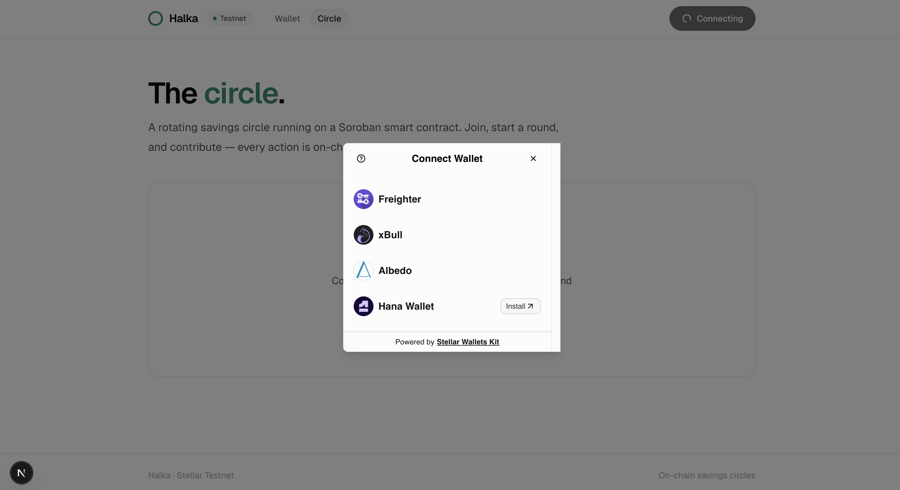
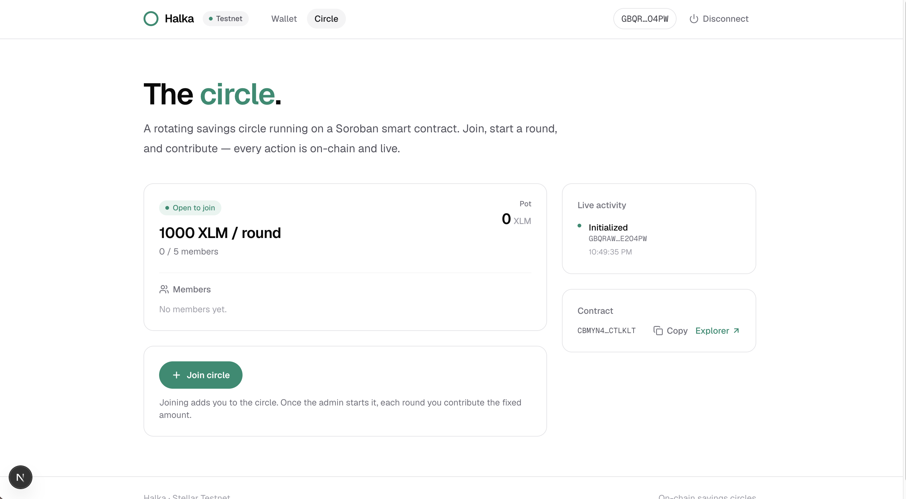
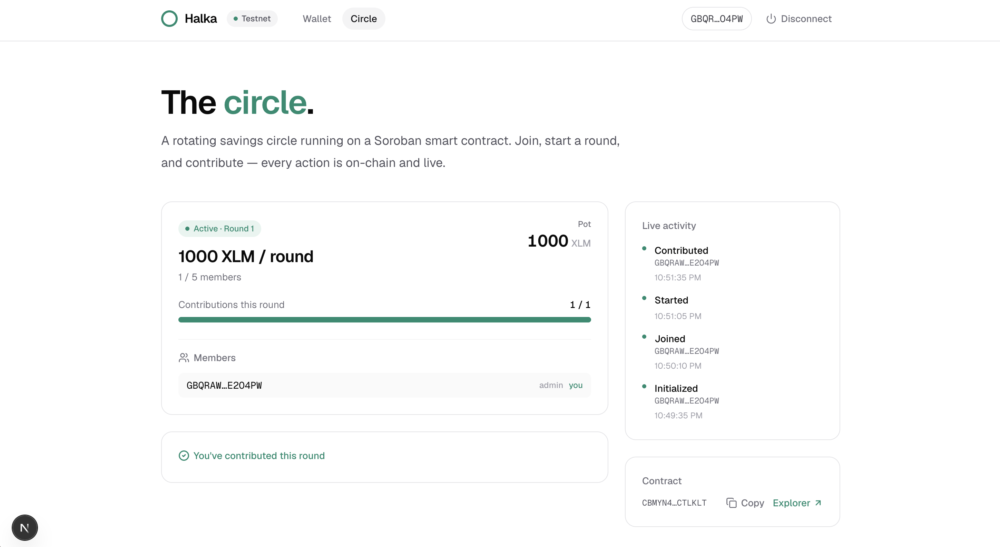

# Halka

**On-chain savings circles (ROSCA) on Stellar.**

Halka turns the trusted savings circle — known as _altın günü_ in Turkey, _tanda_ in Latin America, _susu_ in West Africa, _chit fund_ in India — into a transparent, enforceable, borderless protocol on Stellar.

**Live demo:** [halka-kappa.vercel.app](https://halka-kappa.vercel.app/)

This repository is built level-by-level for the **Stellar Journey to Mastery** builder challenge.

---

## Level 2 — Yellow Belt

Multi-wallet support, a deployed Soroban smart contract, and live on-chain event handling.

### Features
- **Multi-wallet** connection via StellarWalletsKit (Freighter, xBull, Albedo, Hana)
- **`Circle` Soroban contract** deployed on Testnet — create a circle, join, start a round, and contribute
- Contributions are **real token transfers** (native XLM via its Stellar Asset Contract) into the on-chain pot
- **Live activity feed + state sync** driven by contract events (polled from the Soroban RPC)
- **Transaction status** (pending → success / fail) with hash + Explorer links
- Robust **error handling**: wallet rejected, wrong network, and contract errors (already a member, not a member, already contributed, …)

### Deployed contract (Testnet)
| Item | Address |
| --- | --- |
| `Circle` contract | `CBMYN4H5BTMLRPZUZBMPT4FKHL7BNAC5P2I4JLHUDTYA4FB46NCTLKLT` |
| Token (native XLM SAC) | `CDLZFC3SYJYDZT7K67VZ75HPJVIEUVNIXF47ZG2FB2RMQQVU2HHGCYSC` |

See [`docs/deployments.md`](docs/deployments.md) for the deploy transaction hash and explorer links.

### Screenshots
| Wallet options | Circle dashboard | Contract call (tx) |
| --- | --- | --- |
|  |  |  |

---

## Level 1 — White Belt

A working Stellar **Testnet** dApp covering the fundamentals: wallet connection, balances, and payments.

### Features
- **Connect / disconnect** a Stellar wallet on the Testnet
- **Fetch and display** the connected wallet's XLM balance
- **Fund** an unfunded account with one click via Friendbot
- **Send an XLM payment** to any address (auto-creates the account if new)
- Clear **success / failure** feedback with the **transaction hash** and an Explorer link

### Screenshots
| Wallet connected | Balance displayed | Successful transaction |
| --- | --- | --- |
|  |  |  |

---

## Tech stack
- [Next.js 16](https://nextjs.org/) (App Router) + TypeScript + [TailwindCSS v4](https://tailwindcss.com/)
- [`@stellar/stellar-sdk`](https://github.com/stellar/js-stellar-sdk) (Horizon + Soroban RPC + contract client)
- [StellarWalletsKit](https://github.com/Creit-Tech/Stellar-Wallets-Kit) (multi-wallet)
- [Soroban](https://developers.stellar.org/docs/build/smart-contracts/overview) smart contracts in Rust

---

## Getting started

### Prerequisites
- [Node.js](https://nodejs.org/) 18+ (npm comes bundled)
- A Stellar wallet extension (e.g. [Freighter](https://www.freighter.app/)), set to **Testnet**
- For contracts: [Rust](https://www.rust-lang.org/) + the [Stellar CLI](https://developers.stellar.org/docs/tools/cli)

### Run the web app
```bash
cd web
npm install
npm run dev
```
Open [http://localhost:3000](http://localhost:3000), then:
1. Go to **Circle** and **Connect wallet** (pick any supported wallet).
2. Create the circle (sets you as admin), **Join**, **Start**, then **Contribute**.
3. Watch the live activity feed update as transactions confirm on-chain.

### Smart contracts
```bash
cd contracts
cargo test          # run the contract test suite
stellar contract build
```
Contracts live in `contracts/circle`. Generated TypeScript bindings live in `web/packages/circle-client`.

---

## Network

Halka runs entirely on the **Stellar Testnet** for Levels 1–3. Mainnet is part of the roadmap.

## Roadmap
- **L1 — White Belt:** wallet, balance, payments ✓
- **L2 — Yellow Belt:** multi-wallet + `Circle` Soroban contract with live events ✓
- **L3 — Orange Belt:** `Factory` + `Reputation` contracts, payout rotation, tests, CI/CD, mobile
- **L4+:** real users, anchor fiat ramps, yield, portable on-chain credit score
